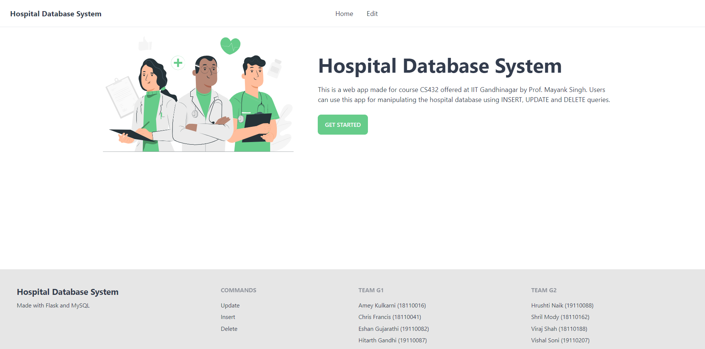
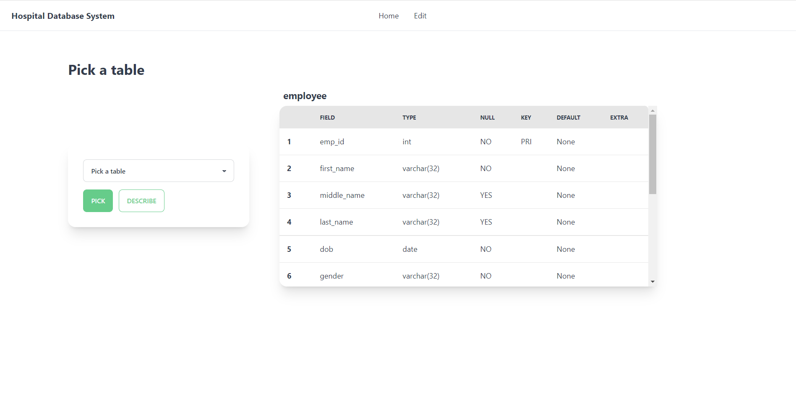
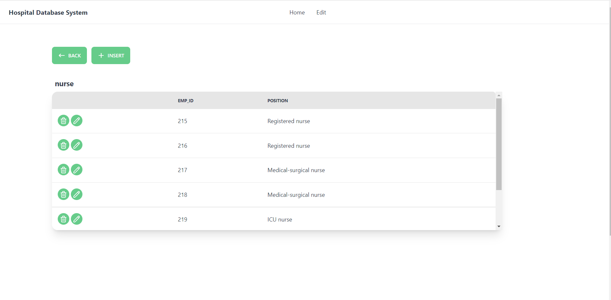
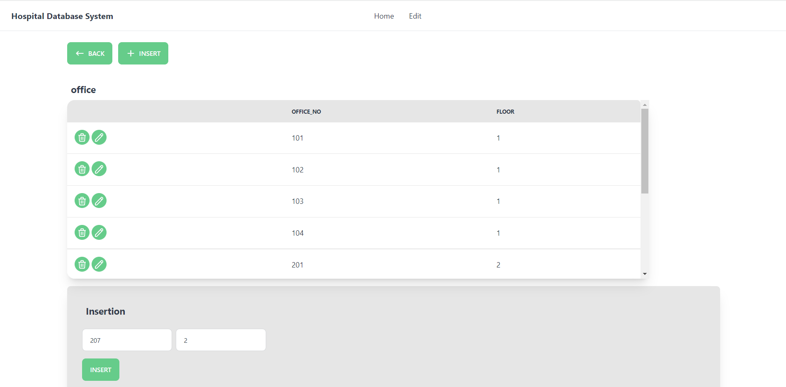
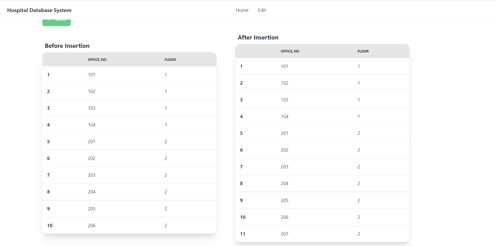
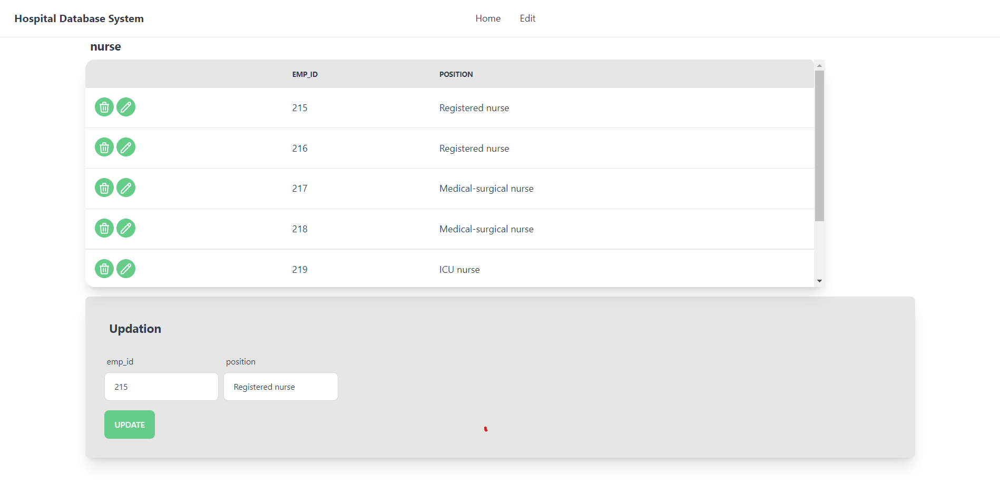
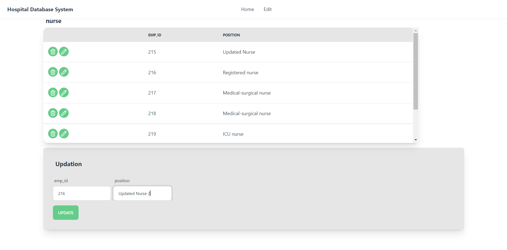
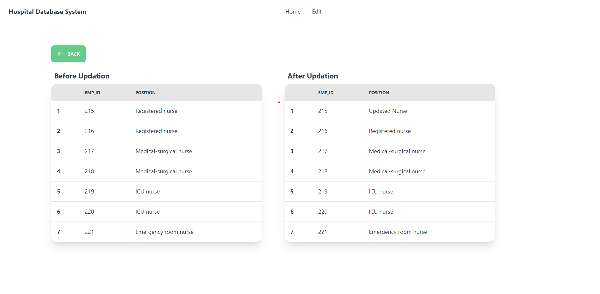
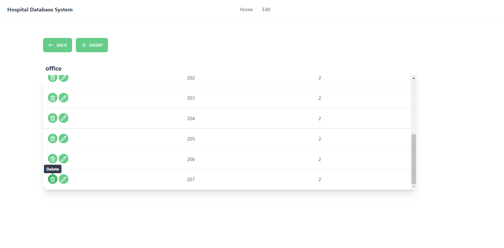
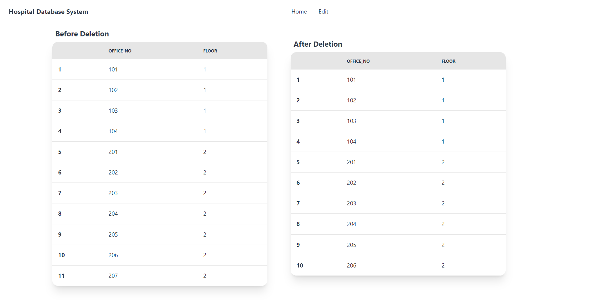

# Hospital Database System 🏥
A Flask web application for a hospital database system. 
CS 432: Databases assignment, IIT Gandhinagar.

# Files 📁

* [`contributions.txt`](https://github.com/frank-chris/HospitalDatabaseSystem/blob/main/contributions.txt)    
* [`hospitalDB.sql`](https://github.com/frank-chris/HospitalDatabaseSystem/blob/main/hospitalDB.sql)   
* [`README.pdf`](https://github.com/frank-chris/HospitalDatabaseSystem/blob/main/README.pdf)   
  
# Requirements ⚡
1) MySQL
2) Python 3
3) MySQLdb
4) Flask
5) Flask-MySQLdb

# Instructions to run the web app ⏩

## Install the following packages
```
pip install mysqlclient/ apt-get install python3-mysqldb
```
```
pip install Flask
```
```
pip install Flask-MySQLdb
```

## Import hospitalDB.sql (dump file) to MySQL as a database named hospitalDB

```
mysql -u tempuser -p hospitalDB < hospitalDB.sql
```

## Create a MySQL user as follows

```
CREATE USER 'tempuser'@'localhost' IDENTIFIED BY '123+Temppass';
```

## Grant permission to the account

```
GRANT ALL PRIVILEGES ON hospitalDB.* TO 'tempuser'@'localhost';
```

## Run the web app

```
python3 web_app.py
```

# Examples for each command ⭐

## Home Page


## Pick Table


## Describe Table


## View Table


## Insert Entry


## Insert Successful


## Pick entry for updation


## Update Entry


## Update Successful


## Delete Entry


## Delete Successful


# Contributors ✏️

### TEAM G1

* Amey Kulkarni (18110016)

* Chris Francis (18110041)

* Eshan Gujarathi (19110082)

* Hitarth Gandhi (19110087)

### TEAM G2

* Hrushti Naik (19110088)

* Shril Mody (18110162)

* Viraj Shah (18110188)

* Vishal Soni (19110207)
